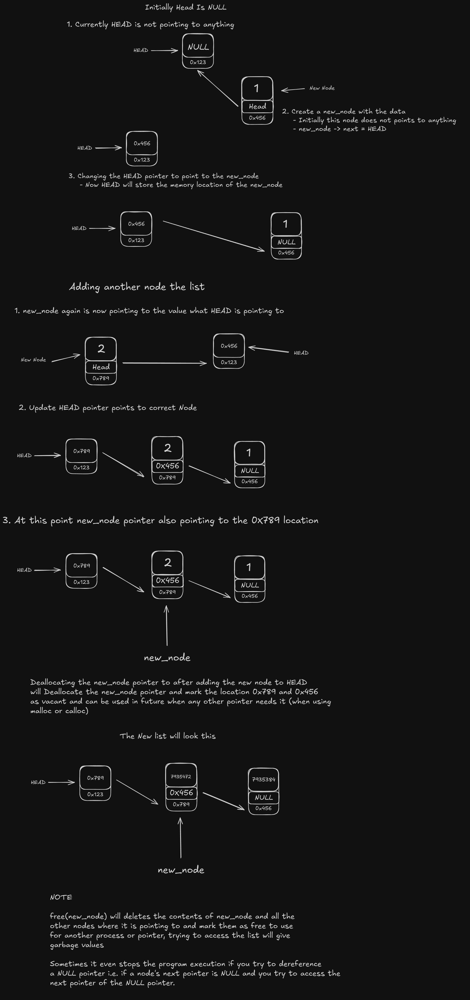

# Algorithms And Data Structures

## Deallocating a Pointer

  

  - Deallocating a pointer will give undefined behaviours if not used correctly
  
  - When creating a linked-list we create a temporary_node which contains the data & next pointer
  
  - After attaching this **new_node** to the linked-list we might think to free the memory location of the **new_node**, but this is a bad idea because we plan to use linked-list in future
  
  - When we deallocates the memory location of the **new_node** this will mark that memory location as free to use for another and since **HEAD** is also pointing to the **new_node** accessing **HEAD** might give **garbage value**
  
  - Sometimes it stops program execution if you try to access **next** pointer of the pointer which is already **NULL**